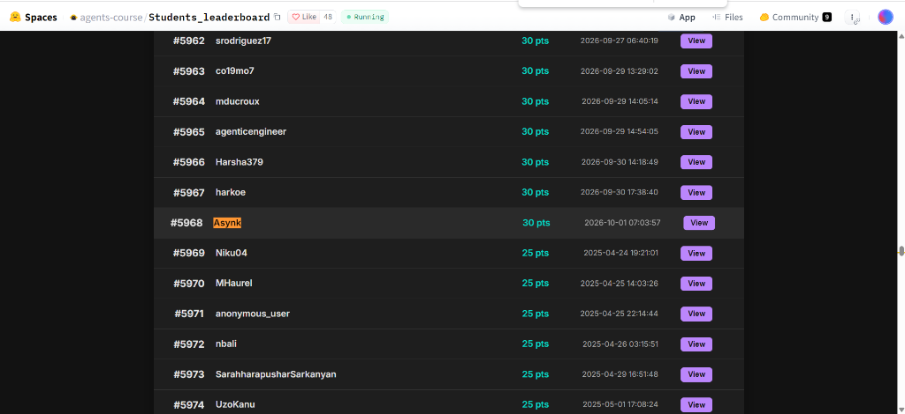
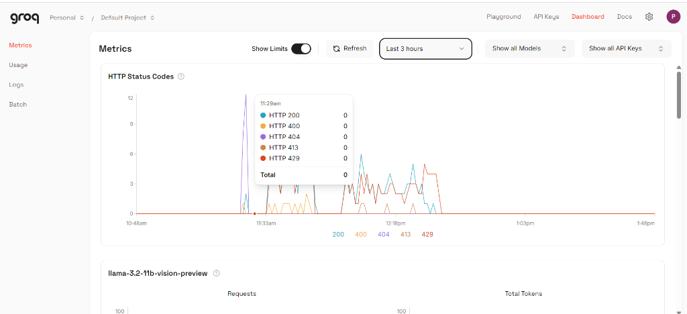
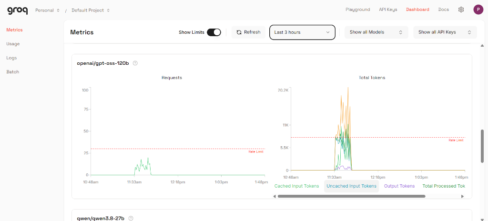
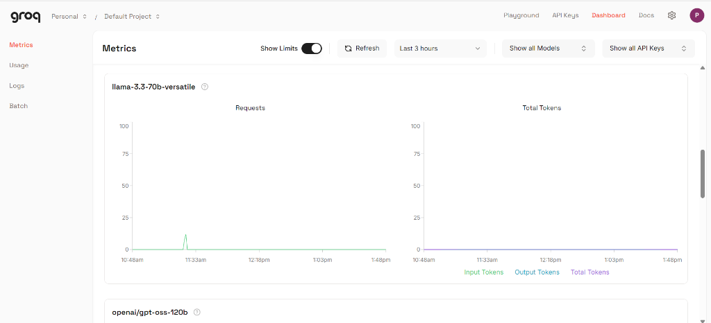
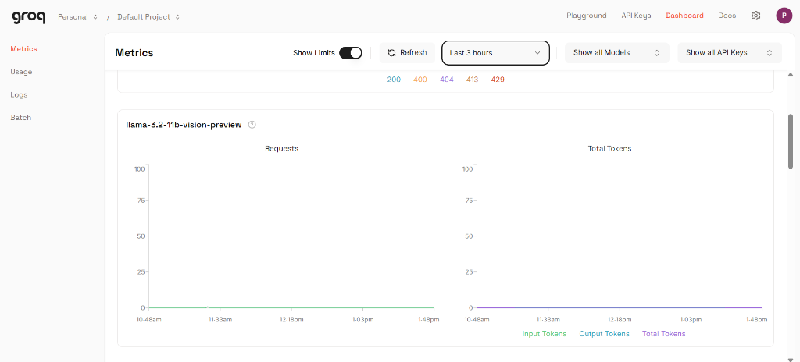

# 🤖 GAIA Benchmark System — HuggingFace Agents Course Final Assignment

> **Score: 30% (6/20) — Certificate Earned ✅**
> 
> A LangGraph ReAct Agent that answers 20 GAIA benchmark questions using Groq (Qwen 3.8-27B) as the reasoning backbone, with Gemini 2.5 Flash for vision/fallback and Groq Whisper for audio transcription.

[](https://huggingface.co/spaces/agents-course/Students_Leaderboard)

**🏆 Leaderboard Rank: #5968 | User: Asynk | 30 pts**

---

## 📂 Project Structure

```
GAIA-Benchmark-System/
├── 📄 app.py                  # Gradio UI — fetches questions, runs agent, submits answers
├── 🧠 agent.py                # Core ReAct agent — LLM routing, multimodal handling, fallback logic
├── 📝 prompts.py              # System prompt — tool constraints, exact-match formatting rules
├── 📦 requirements.txt        # Python dependencies
├── 📋 logs.txt                # Full run logs from both benchmark attempts
├── 📖 README.md               # This file
├── 🔑 .env.example            # Template for API keys
├── 🚫 .gitignore              # Ignore venv, __pycache__, .env
│
├── 🔧 tools/                  # Agent's 7 tools
│   ├── __init__.py            # Package init
│   ├── web_search.py          # DuckDuckGo search, webpage scraper, Wikipedia API
│   ├── file_tools.py          # Python executor, Excel reader, file downloader
│   └── multimedia.py          # YouTube transcript extractor, image/audio encoders
│
├── 🖼️ assets/                 # Screenshots & metrics for documentation
│   ├── leaderboard.png        # HuggingFace leaderboard showing #5968 Asynk 30pts
│   ├── groq_http_status.png   # Groq API HTTP status codes over time
│   ├── groq_llama_vision.png  # Llama 3.2 Vision model metrics (decommissioned)
│   ├── groq_llama_versatile.png # Llama 3.3 70B model metrics (404 not found)
│   └── groq_gpt_oss_120b.png  # GPT-OSS-120B token usage hitting rate limits
│
└── 📡 hf-space/               # Deployed HuggingFace Space (git submodule)
    ├── README.md              # HF Space config + documentation
    ├── app.py                 # Same as parent
    ├── agent.py               # Same as parent
    ├── prompts.py             # Same as parent
    ├── requirements.txt       # Same as parent
    └── tools/                 # Same as parent
```

---

## 🏗️ Architecture

```
┌─────────────────────────────────────────────────────────────┐
│                        Gradio UI (app.py)                   │
│   Login → Fetch 20 Questions → Run Agent → Submit Answers   │
└──────────────────────────┬──────────────────────────────────┘
                           │
                           ▼
┌─────────────────────────────────────────────────────────────┐
│                    GAIAAgent (agent.py)                      │
│                                                             │
│  ┌──────────────┐   ┌──────────────┐   ┌────────────────┐  │
│  │  Classifier   │──▶│  LangGraph   │──▶│  Answer Clean  │  │
│  │  (type/file)  │   │  ReAct Loop  │   │  (_clean_answer│  │
│  └──────────────┘   └──────┬───────┘   └────────────────┘  │
│                            │                                │
│         ┌──────────────────┼──────────────────┐             │
│         ▼                  ▼                  ▼             │
│  ┌─────────────┐   ┌─────────────┐   ┌──────────────┐     │
│  │ Groq Qwen   │   │ Gemini 2.5  │   │ Groq Whisper │     │
│  │ 3.8-27B     │   │ Flash       │   │ Large v3     │     │
│  │ (reasoning) │   │ (vision +   │   │ (audio)      │     │
│  │             │   │  fallback)  │   │              │     │
│  └─────────────┘   └─────────────┘   └──────────────┘     │
└─────────────────────────────────────────────────────────────┘
                           │
            ┌──────────────┼──────────────────┐
            ▼              ▼                  ▼
     ┌────────────┐ ┌────────────┐   ┌──────────────┐
     │ Web Tools  │ │ File Tools │   │ Media Tools  │
     │• web_search│ │• exec_py   │   │• yt_transcript│
     │• visit_page│ │• exec_file │   │• img_encode  │
     │• wiki_srch │ │• read_excel│   │• audio_encode│
     └────────────┘ └────────────┘   └──────────────┘
```

---

## 📊 Performance Journey: 25% → 30%

### Run 1: `openai/gpt-oss-120b` — ❌ 25% (5/20)

| Issue | Questions Affected | Root Cause |
|-------|-------------------|------------|
| Tool hallucination (`find_in_page`) | Q1, Q17 | Model invented non-existent tools → instant crash |
| Fallback fails (`tool_choice=none` ignored) | Q2,Q5,Q7,Q8,Q11,Q13,Q15,Q16 | Model called tools even when explicitly told not to |
| Gemini 2.0 Flash deprecated | Q4 | Vision model returned 404 |

### Run 2: `qwen/qwen3.8-27b` — ✅ 30% (6/20)

| Fix Applied | Impact |
|-------------|--------|
| Switched to `qwen/qwen3.8-27b` | No more tool hallucination — follows schemas properly |
| Gemini 2.5 Flash fallback | Proper answer synthesis when Groq hits limits |
| Response parsing fix | Extracted text from Gemini's `[{type: text, text: ...}]` format |
| Tool output truncation | Stayed within 7000 ITPM limit (5k chars webpage, 6k wiki) |
| `max_tokens` → 900 | Stayed under 1000 OTPM limit |
| Handle 413 errors | Graceful fallback instead of crash |

### Score Comparison

```
Run 1 (gpt-oss-120b):  ██████████████░░░░░░░░░░░░░░  25% (5/20) ❌
Run 2 (qwen3.8-27b):   ████████████████░░░░░░░░░░░░  30% (6/20) ✅
                        ▲                               ▲
                        │                               │
                    Tool hallucination              Fixed with Qwen +
                    + broken fallback               Gemini fallback
```

---

## 📈 Groq API Metrics

### Model Comparison on Groq Free Tier

| Model | Tool Compliance | Token Limits | Outcome |
|-------|----------------|--------------|---------|
| `openai/gpt-oss-120b` | ❌ Hallucinated `find_in_page`, `repo_browser` | Higher ITPM/OTPM | 25% — tools crashed |
| `llama-3.3-70b-versatile` | ⚠️ 404 Not Found | N/A — decommissioned | N/A |
| `llama-3.2-11b-vision-preview` | ⚠️ 400 Decommissioned | N/A — decommissioned | N/A |
| **`qwen/qwen3.8-27b`** | **✅ Perfect tool schema compliance** | 7K ITPM, 1K OTPM, 200K TPD | **30% ✅** |

### HTTP Status Codes (Groq Dashboard)



*Mix of 200 (success), 413 (input too large), and 429 (rate limited) responses across runs.*

### GPT-OSS-120B Token Usage



*Run 1 with gpt-oss-120b: High token usage (~20K uncached input tokens) but constant tool hallucination errors made it unusable despite having more generous rate limits.*

### Llama 3.3 70B Versatile (Attempted)



*Llama 3.3-70b-versatile returned 404 — model was no longer available on Groq's free tier during testing.*

### Llama 3.2 Vision (Attempted)



*Llama 3.2-11b-vision-preview was decommissioned — zero successful requests.*

---

## 🔧 Key Technical Decisions

### 1. Multi-Model Strategy
- **Groq Qwen 3.8-27B** → Primary reasoning (follows tool schemas, fast inference)
- **Gemini 2.5 Flash** → Vision analysis (images), fallback synthesis when Groq hits limits
- **Groq Whisper Large v3** → Audio transcription (free, high quality)

### 2. Token Budget Management
Groq's free tier for `qwen3.8-27b` is extremely tight:
- **7,000 ITPM** (input tokens per minute) → truncated tool outputs to 5K chars
- **1,000 OTPM** (output tokens per minute) → set `max_tokens=900`
- **200,000 TPD** (tokens per day) → exhausted by Q15 in Run 2

### 3. Robust Error Handling
```
Tool Hallucination → Gemini fallback synthesis
413 Input Too Large → Gemini fallback synthesis  
429 Rate Limit     → 15s wait + retry (4 attempts)
GraphRecursionError → Gemini fallback synthesis
Gemini 429         → Groq direct synthesis (no tools)
```

### 4. Exact Match Optimizations
- Reverse text detection → answer forward ("right" not "thgir")
- Macron normalization → "Kato" not "Katō"
- Abbreviation expansion → "Saint Petersburg" not "St. Petersburg"
- Multi-line answer extraction → take last short line as answer

---

## 🚀 Setup

### 1. Clone & Install
```bash
git clone https://github.com/prachin77/Learning.git
cd Learning/AgentsCourse/GAIA-Benchmark-System
python -m venv venv
venv\Scripts\activate        # Windows
# source venv/bin/activate   # macOS/Linux
pip install -r requirements.txt
```

### 2. Set API Keys
```bash
cp .env.example .env
# Edit .env and add:
# GEMINI_API_KEY=your_key   (free from https://aistudio.google.com/)
# GROQ_API_KEY=your_key     (free from https://console.groq.com/)
```

### 3. Run Locally
```bash
python app.py
```

### 4. Deploy to HuggingFace Spaces
1. Create a new Space at [huggingface.co/new-space](https://huggingface.co/new-space)
2. Push the code to the Space repo
3. Add `GEMINI_API_KEY` and `GROQ_API_KEY` as Secrets in Space Settings
4. The Space will auto-build and launch

---

## 📋 GAIA Benchmark

- **20 Level-1 questions** from the GAIA validation set
- **Scoring:** EXACT MATCH (answer must match ground truth character-for-character)
- **Pass threshold:** ≥30% (6/20) for certificate
- **Question types:** Text, Image, Audio, Excel, Python, YouTube

---

## 📜 License

This project was built as part of the [HuggingFace Agents Course](https://huggingface.co/learn/agents-course) final assignment.
